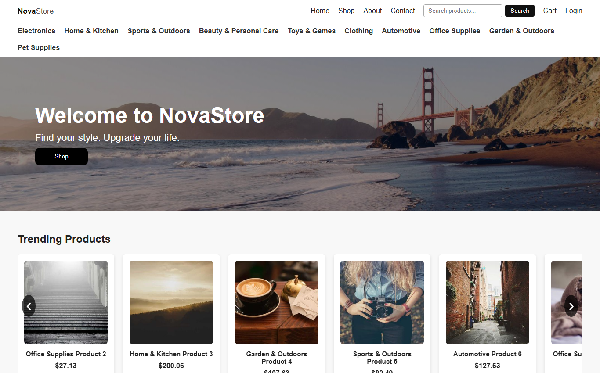
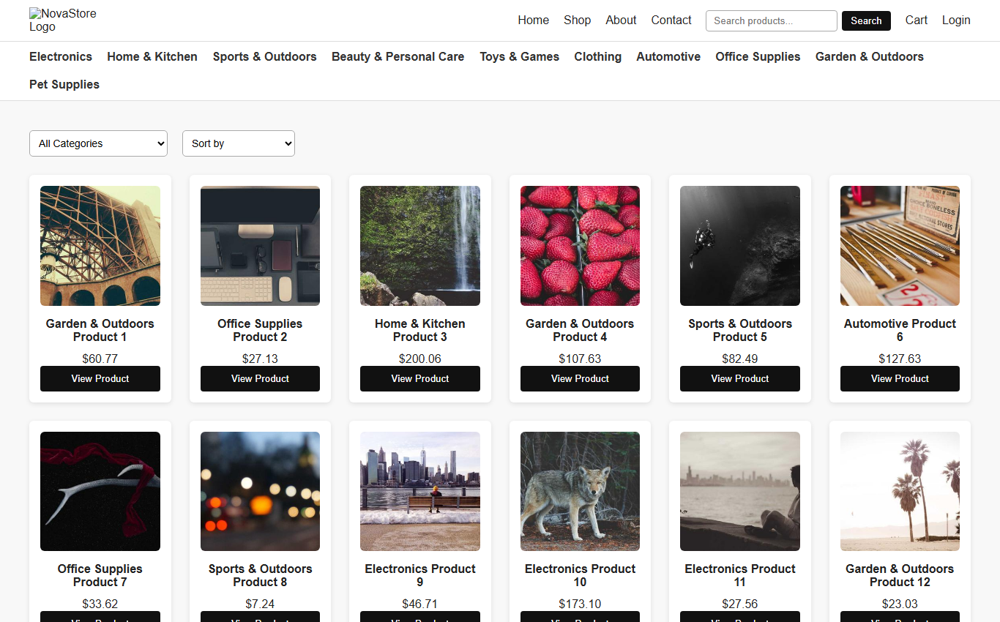
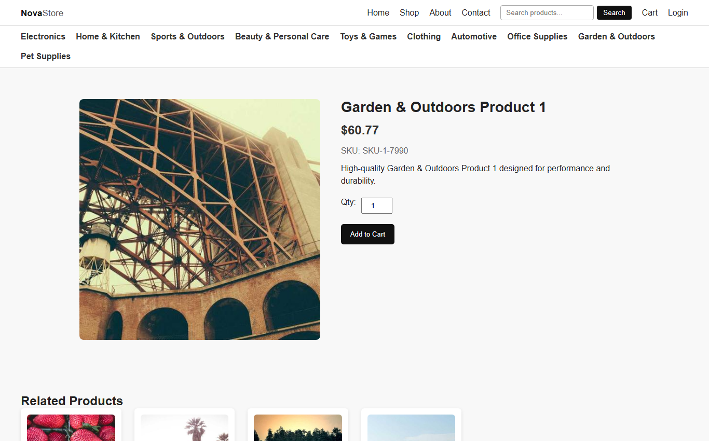

# NovaStore — Loja virtual em HTML, CSS e JavaScript

Site de e-commerce feito só com **HTML, CSS e JavaScript**, sem frameworks. Projeto da disciplina de Internet Programming do Vanier College (Montreal, Canadá), em 2025.

**Demo ao vivo:** https://theomont7.github.io/loja-virtual/



## Funcionalidades

- **12 páginas:** início, loja, busca, produto, carrinho, checkout, confirmação, login, cadastro, perfil, sobre e contato
- **Catálogo dinâmico:** produtos carregados de arquivos JSON e categorias de um arquivo XML, com `fetch` e `DOMParser`
- **Busca e filtros:** busca por nome, filtro por categoria e ordenação
- **Página de produto:** detalhes, avaliações de clientes e produtos relacionados
- **Carrinho e checkout:** alteração de quantidade e cálculo de subtotal, impostos e total
- **Conta de usuário:** cadastro e login com sessão salva em `localStorage`

| Loja | Produto |
| --- | --- |
|  |  |

## Estrutura

```
htmls/    páginas do site
js/       um script por página, mais o cabeçalho compartilhado (header.js)
styles/   uma folha de estilo por página
data/     produtos e avaliações (JSON) e categorias (XML)
```

## Como rodar localmente

O site carrega os dados com `fetch`, então precisa de um servidor local (abrir o arquivo direto no navegador não funciona). Na pasta do projeto:

```bash
npx serve .
```

Depois abra o endereço que aparecer no terminal. A extensão Live Server do VS Code também funciona.

## Tecnologias

HTML5 · CSS3 · JavaScript · JSON · XML
